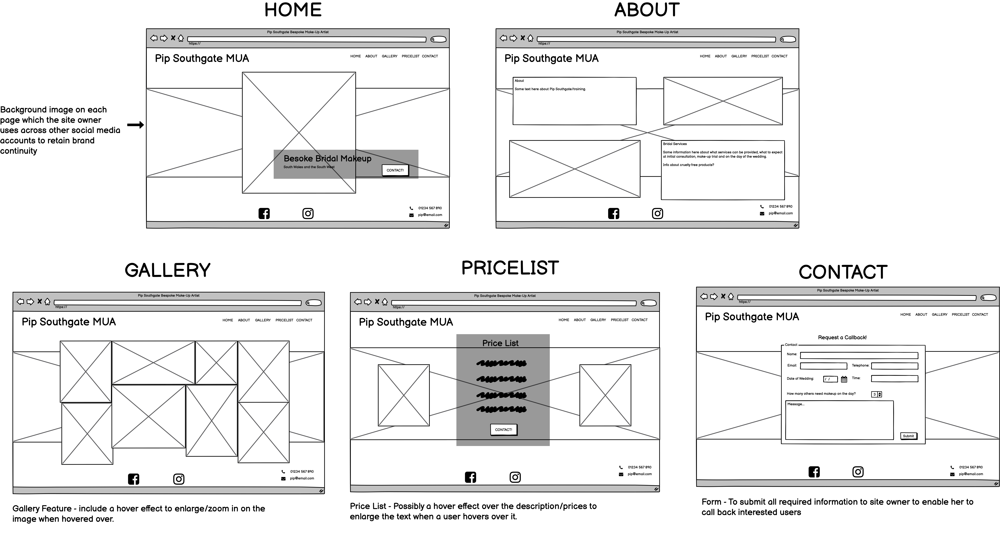

# Pip Southgate MUA - Bespoke Bridal Makeup

This website is aimed mainly at brides-to-be looking for a professional Makeup Artist (MUA) in South Wales, South of England and The Midlands.  It is designed to give information about the site owner Pip Southgate, her experience and the service she provides.  It is also designed to showcase the work she has done on her previous clients by incorporating a gallery and providing information about the costs of her services.  It is also aimed at women who maybe looking for a Makeup Artist to provide services for a special occasion such as a prom, hen party or simply a girls night out.  Users of the site will be able to gain contact information for the Makeup Artist and also submit a request for the Makeup Artist to contact them.

From the site owner's perspective, the aim of the website is to generate revenue by providing information about services, showcasing skills through the gallery and encouraging potential clients to make contact.  

(is my site responsive screenshots)

Link to deployed site:

[Pip Southgate MUA - Bespoke Bridal Makeup](https://shellied.github.io/pip-southgate-mua/)

## Strategy
----

The site's srategy is focused on providing users with the following:-

* Background information about Pip Southgate, her training and experience, location and style/ethos.

* Real-life examples of Pip Southgate's work on former clients.

* A full breakdown of the costs involved in hiring a Makeup Artist for a wedding.

* Contact information and ability to submit a request for a callback from the Makeup Artist.

## Structure
----

The site will consist of five pages - Home, About, Gallery, Pricelist and Contact.  The below wireframe were created using Balsamiq:-

### Features 

* Features included on each page:-
    - Clickable logo which links to the homepage 
    - Intuitive navigation menu 
    - Footer with Social Media Links to Facebook and Instagram
    - Telephone number and email address in footer on each page
    - Background image (brand continuity - as requested by site owner) 

  

* Home Page Features
    - Hero-image of former client
    - Text overlay indicating area covered by MUA
    - Contact button - call to action - links to contact page

 

* About Page Features
    - 2 x Information boxes
        - Information about the MUA - Training, experience, style and ethos 
        Link to gallery page.
        - Information about services - what to expect at Makeup Trial, what to expect on wedding day, other services
    - 2 x Photographs of MUA applying makeup to brides

 

* Gallery Features
    - Masonry style image gallery 
    - Effect applied to enlarge images when hovered over
    - Butto
    Link to contact page

 

* Price List Features
    - Full breakdown of services
    - Customer reviews
    - Clickable button t
    Link to contact page

 

* Contact Form
    - Input fields to submit name, email address, and venue of event
    - Date and time picker to choose date/time of event
    - Number picker - to chose the number of people requiring makeup
    - Text area to add more information for MUA
    - Submit button
    Link to request page)

 

* Thank-you Page

    In addition to the pages above, I decided to add a thank you page, during the build process.

    - The thank-you page will appear only when the contact form has been completed and submitted.  It will display a short message to thank users for getting in contact and confirming the MUA will make contact shortly.

    - Potentially add further links to Facebook and Instagram.

 

### Features Left to Implement

* Create an events page which will show upcoming wedding fayres where potential client's can meet Pip Southgate face-to-face to ask questions.
* Create a customer reviews page 
* Link above two pages to the about page via a drop-down menu on the navigation bar

## Testing
----

* browsers and screen sizes/devices

### Validator testing 
* HTML (W3C Validator)
* CSS (Jigsaw)
* Lighthouse?

### Bugs
* fixed
* unfixed

## Deployment 
----
 This site was depoloyed to GitHub pages.  The steps taken to deploy the site are as follows:

 * In the GitHub respository, select the settings menu
 * Choose the pages tab on the left hand side menu
 * From the source section drop-down menu, select the 'Main' branch
 * Once the page has automatically refreshed, the link to the successfully deployed page will be displayed.

Live link found here:  [Pip Southgate MUA - Bespoke Bridal Makeup](https://shellied.github.io/pip-southgate-mua/)

## Credits
----

* I used very similar code for my home page, nav bar and footer as taught in the 'Love Running Walkthrough Project' on the [Code Institute's](https://codeinstitute.net/) Full Stack Web Development course.  I did change some styling , but ultimately I was aiming for a simliar layout for my main page and navigation links/footer and this code helped me to get my project off to a good start.

* [CSS-Tricks](https://css-tricks.com/) has been an invaluable resource and I have read many articles relating to positioning, styling my contact form (which gave me a bit of headache to be honest!!)

* [W3 Schools](https://www.w3schools.com/) - Again a valuable resource for consolidating what I had already learned and finding out more about HTML and CSS properties.

* [ColorSpace](https://mycolor.space/) - I used this website to select a color pallete, I started with a natural dark brown similar to that of the wood in the banner image and used that to generate a pallette of complementing colors.  From a selection of palettes generated, I chose the 'Classy Palette'

* [StackOverflow](https://stackoverflow.com/) 

* [Google](http://google.com)

* [Online Convert](https://image.online-convert.com/convert-to-webp) - used to convert images from jpeg to webp for better performance

* Pip Southgate - for providing all images and content for the website (permissions receieved from any wedding photographers and former-clients to use images).

## Technologies Used
----
* HTML
* CSS
* FontAwesome
* Google Fonts
* GitHub
* GitPod
* GitPages

