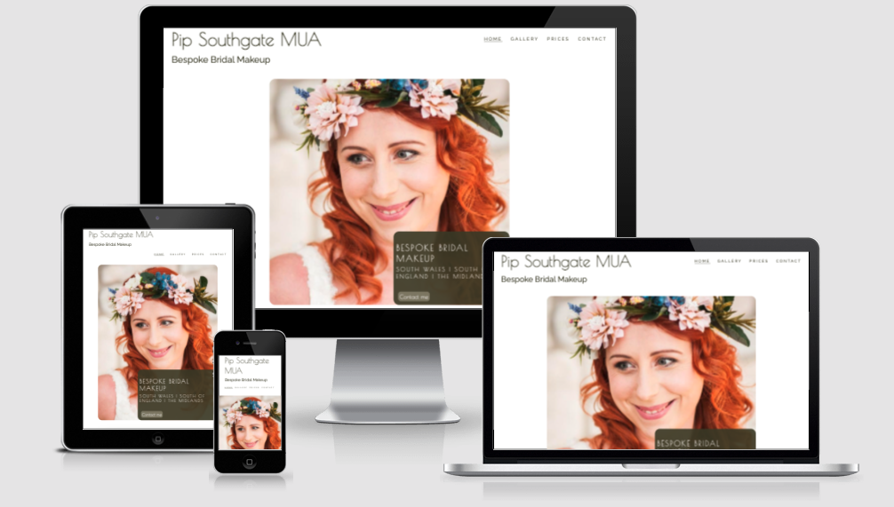
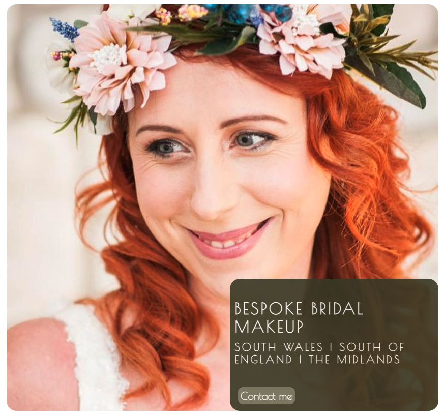
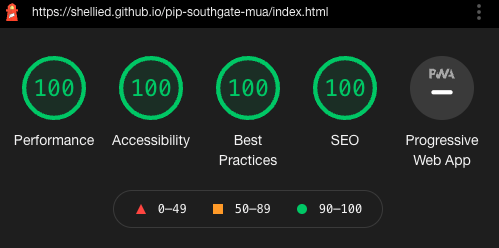

# Pip Southgate MUA - Bespoke Bridal Makeup

This website is aimed mainly at brides-to-be looking for a professional Makeup Artist (MUA) in South Wales, South of England and The Midlands.  The aim is to give information about the site owner - Makeup Artist Pip Southgate, her experience and the service she provides.  It is also designed to showcase the work she has done on her previous clients by incorporating a gallery and providing information about the costs of her services.  It is also aimed at women who maybe looking for a Makeup Artist to provide services for a special occasion such as a prom, hen party or simply a girls night out.  Users of the site will be able to gain contact information for the Makeup Artist and also submit a request for the Makeup Artist to contact them.

From the site owner's perspective, the aim of the website is to generate revenue by providing information about services, showcasing skills through the gallery and encouraging potential clients to make contact.  



Link to deployed site:

[Pip Southgate MUA - Bespoke Bridal Makeup](https://shellied.github.io/pip-southgate-mua/)


## Strategy
----

### User Stories

The site's srategy is focused on satisfying the below user stories:-

* As a user of the website I want to be able to navigate around the website eaily and intuitively.

* As a user of the website, I want to find out background information about Pip Southgate, her training and experience, location and style/ethos.

* As a user of the website I want to be able to view real-life examples of Pip Southgate's work on former clients.

* As a user of the website I want to be able to see a full breakdown of the costs involved in hiring a Makeup Artist for a wedding/special occassion.

* As a user of the website I want access to contact information and the ability to submit a request for a callback from the Makeup Artist to show I am interested in her services.


## Structure
----

The site will consist of four main pages; Home, Gallery, Pricelist and Contact, and a hidden thank you page which will only appear when the contact form has been completed and submitted:- 

<details>
<summary>Desktop Wireframes</summary>
<br>


</details>

<details>
<summary>Mobile Wireframes</summary>
<br> 


</details>


## Design
----

The site owner wanted a classic style to the website.  We initially decided on a color scheme incorporating natural tones of subtle pinks and greens and that colour pallete was selected using [ColorSpace](https://mycolor.space/), but during the build I felt that the colour scheme distracted from the imagery and after checking the colour pallete using [EigthShapes Contrast Grid](https://contrast-grid.eightshapes.com/?version=1.1.0&background-colors=&foreground-colors=%23FFFFFF%2C%20White%0D%0A%23F2F2F2%0D%0A%23DDDDDD%0D%0A%23CCCCCC%0D%0A%23888888%0D%0A%23404040%2C%20Charcoal%0D%0A%23000000%2C%20Black%0D%0A%232F78C5%2C%20Effective%20on%20Extremes%0D%0A%230F60B6%2C%20Effective%20on%20Lights%0D%0A%23398EEA%2C%20Ineffective%0D%0A&es-color-form__tile-size=compact&es-color-form__show-contrast=aaa&es-color-form__show-contrast=aa&es-color-form__show-contrast=aa18&es-color-form__show-contrast=dnp) I realised it was not great in terms of contrast/accessibility.  After some discussion with the site owner, we decided to go with a more sleek and simple design.  We chose a simple three colour palette of a dark leafy green, similar to that in the head-dress worn by the client in the hero-image, a slightly paler shade of leafy green (used only on styling buttons) and these were used in contrast with an off-white.  This dark green colour and off-white combination gives the highest rating in compliance with [WCAG 2.0 minimum contrast](https://www.w3.org/TR/UNDERSTANDING-WCAG20/visual-audio-contrast-contrast.html) for text/background.  


All of the images used throughout the site have been provided by Pip Southgate and are images of her former clients.  Permission has been given from the clients and photographers - where the photos have not been taken by Pip herself - to use the images on her website and social media pages.  The images on the 'thank-you' page and '404 error page' were sourced from Pexels and photographer credits have been included beneath each. 

Google Fonts was used to select a classy and stylish looking font for the main logo and headings - 'Poiret One' and this was paired with the widely used 'Raleway' for the main content.  A third font was used on the thank-you page only - this was used to give a more handwritten, personal style to the sign-off of the thank-you message.  The font used here was 'Indie Flower'.

## Features 
----

### Existing Features

* Logo
    - Clickable logo which allows the user to easily navigate back to the home page. This is a simple text design incorporating the name of the website.


* Navigation Menu 
    - This features on all pages of the website.  The position and style is consistent across all pages to allow the user to intuitively navigate each page of the website.  The navigation menu also has an active class applied so the user can easily see which page they are currently on as the associated link will be marked with a neat bottom border.


* Footer 
    - Social Media Links to Facebook and Instagram to allow the user to stay connected to the make-up artist and see regular posts.
    - Telephone number and email address in footer on each page.  This means that the user does not have to navigate to a different page to have access to this information if they decide they want to email or telephone. 

   
  

* Home Page Features
    - The Hero-image is high quality photograph of former client of Pip Southgate on her weddig day.  The image is quite striking with the contrast between the bright orange hair of the client and the natural tones in her headress. This image was chosen as it showcases the natural style Pip Southgate has with her makeup application.
    - There is a text overlay box which briefly summarises the areas covered by the MUA, but leaves out enough information to entice the site user to make an enquiry.
    - There is also a contact button within the text overlay box which links directly to the contact page.  This acts as a call to action to encourage the site user to submit their details to arrange a callback.  The contact button has a hover effect applied so the button grows when it is hovered over to draw attention to itself.  The same effect is used on all buttons across the site.

   


* Home Page Features Continued...
    - The home page also contains two information boxes and two further images.  The first information box provides the site user with a brief introduction to Pip Southgate, her training, experience, style and ethos.  There is also a link to encourage the user to visit the gallery.  
    - The second information box provides key information about the services provided - what to expect at a Makeup Trial, what to expect on wedding day and other services available.  There is a link here to view the pricelist of the services.
    - The information boxes are styled with a border and box shadow matching the color of the text to allow the information boxes to stand out.
    - As a decorative feature for this section, there are two images of the Makeup Artist applying makeup to her clients.  These are displayed on larger screens, but are then hidden on smaller screens, such as mobile phones. 


* Gallery Features
    - A masonry style gallery has been used to show images of the Makeup Artists former clients.  A hover effect has been applied to the images so they scale up once hovered over. 


* Price List Features
    - Full breakdown of services
    - Clickable button to link to contact page - zoom effect when hovered over to grab attention of user.


* Contact Form
    - Input fields to submit name, email address, and venue of event.
    - Date and time pickers to choose date/time of event.
    - Number picker - to chose the number of people requiring makeup.
    - Text area to add more information or a message for the MUA.
    - Submit button - zoom effect.  This button currently links to a thank-you page where a thank you message is displayed to let the site user know their information has been submitted. 
    - Each field has a ```required``` attribute applied to ensure users input all fields before submiting the form


* Thank-you Page
    - The thank-you page will appear only when the contact form has been completed and submitted.  It will display a short message to thank users for getting in contact and confirming the MUA will make contact shortly.


<br/>

* Custom 404 Page
    - I have created a custom 404 error page which will be displayed if any of the links break during future development of the site.  This page is consistent with the design of the main site and contains the same logo, navigation and footer.  There is also a link to the home page within the error message so site users are able to easily navigate back to the home page. 


### Features Left to Implement

* Create an events page which will show upcoming wedding fayres where potential client's can meet Pip Southgate face-to-face to ask questions.
* Create a customer reviews page. 
* Add a drop down menu to the 'home' link in the navigation menu to link to events page and customer reviews page.


## Testing
----

I have regularly tested all aspects of the site functionality including all links, inputs and responsiveness through Dev Tools in Chrome for the following devices:-

* Galaxy S5
* Pixel 3
* Pixel 2 XL
* iPhone 5/SE
* iPhone 6/7/8
* iPhone 6/7/8 Plus
* iPhone X
* iPhone 11 Pro
* iPad
* iPad Pro
* Surface Due
* Galaxy Fold
* Nest Hub
* Nest Hub Max

I have also tested the site physically on the below devices:

* iPhone 13 pro
* iPhone 11 Pro
* Mac Book Pro 
* Dell Lattitude 5310 (Laptop)

I have also regularly tested the site using the following browsers:-

* Chrome
* Safari
* Firefox
* Edge


### Validator testing 

* CSS file has been run through W3C CSS Validator and no errors have been found.  Two warnings have been found although these related to imported stylesheets which are not checked by the validator.
* All HTML files have been passed through the W3C HTML Validator and no errors have been found. 

<details>


<summary>CSS (W3C Validator)</summary>

</details>

<br>

<details>


<summary>HTML (W3C Validator)</summary>

</details>

<br>

<details>




<summary>Lighthouse Testing</summary>

</details>

### Accessibility Testing

The full site has been passed through wave.webaim.org to check for accessibility and the full report can be found [here.](https://wave.webaim.org/report#/https://shellied.github.io/pip-southgate-mua/contact.html)


### Bugs
---

* One of the issues I had from the beginning of this project was getting the position of the overlay text in the right place.  For a while I couldn't understand why the overlay text would stay in the same position on the screen and not adjust itself responsively, relative to the hero-image.  After many hours of fiddling around with the CSS, I realised that I had not added the ```relative ``` property to the ```#hero-image``` ID and so the overlay text was positioning itself absolute in relation to the ```#hero-image-container``` and not the ```#hero-image``` itself.  

* The image gallery has been one of my biggest problems in this project.  I started off by using a column grid to create a masonry gallery - similar to that used in the Love Running Project on the [Code Institute's](https://codeinstitute.net/) Full Stack Web Development Course.  This worked fine and looked great, until I added a hover effect to the images to allow them to scale up once hovered over.  Overall the effect was quite nice, however I immediately noticed that three of the top images would cut off after scaling up - which didn't look good.  After a discussion with a fellow student, I changed the gallery to flex box which fixed this issue, but brought a much larger issue when it came to making the gallery responsive.  On smaller screen sizes, the images would break out of the container and off the screen, or would break off the screen when scaling up with the hover effect.  I rectified this by adding (what felt like a million) media queries to alter the height of the container and the width of the images, depending on the screen sizes they were viewed on.  I used the dev tools to check for numerous devices and was happy with the results.... UNTIL...... I checked the deployed site on my mobile and the gallery looked NOTHING like I expected it to look like.  Will this bug remain unfixed???? or will I find a way to resolve it in the nick of time before project submission?????  Another issue I see with the way this gallery has been created is that it will be difficult to add new images to the gallery in the future.  With the benefit of hindsight, I can see that a carousel style gallery using pure CSS could have probably worked better than what I have ended up with.  In future development of this site, I would like to create a more robust gallery that is easier to update and has a slicker finish to it.

### - Bugs to fix 

* Despite the buttons on the 'Price List' and 'Contact' pages having the exact same CSS applied to them, the styling would be applied differently when in the browser - one would have the  zoom effect applied but the other wouldn't and in the Safari browser, the buttons would have different a border radius.  I realised this was because the button on the pricelist page was set as an anchor tag and the the button on the contact page was an ```input type="submit"``` button and part of the form.  I fixed this issue by changing the button on the pricelist page to from:

 ``` <a href="contact.html class="enquire-button">Contact Me</a>``` 
 
 to 

```<form action="contact.html" method="GET" aria-label="Click to open contact page"> <input type="submit" value="Contact Me" class="enquire-button"> </form>``` 
                
reusing the class attribute attached to the submit button on the contact page so as not to repeat code.  This produced the desired effect and both buttons now look and work the same. 

Whilst this is not semantically perfect, for the purpose of this project and given the time constraints, this is a suitable workaround for the time-being.  This is a bug I would like to rectify in the future when I have further understanding of applying CSS to different elements to maintain consistency across site.


## Deployment 
----
 This site was depoloyed to GitHub pages.  The steps taken to deploy the site are as follows:

 * In the GitHub respository, select the settings menu
 * Choose the pages tab on the left hand side menu
 * From the source section drop-down menu, select the 'Main' branch
 * Once the page has automatically refreshed, the link to the successfully deployed page will be displayed.

Live link found here:  [Pip Southgate MUA - Bespoke Bridal Makeup](https://shellied.github.io/pip-southgate-mua/)

## Credits
----

* I used very similar code for my home page, nav bar and footer as taught in the 'Love Running Walkthrough Project' on the [Code Institute's](https://codeinstitute.net/) Full Stack Web Development course.  I did change some styling, but ultimately I was aiming for a simliar layout for my main page and navigation links/footer and as this was my first project this code helped me to get off to a good start.

* [CSS-Tricks](https://css-tricks.com/) has been an invaluable resource and I have read many articles relating to positioning, flexbox, and styling my contact form.

* [W3 Schools](https://www.w3schools.com/) - Again a valuable resource for consolidating what I had already learned and finding out more about HTML and CSS properties.

* [ColorSpace](https://mycolor.space/) - I used this website to select a color pallete, I started with a natural dark brown similar to that of the wood in the banner image and used that to generate a pallette of complementing colors.  From a selection of palettes generated, I chose the 'Classy Palette' - although as set out at the beginning of this document, this colorscheme was scrapped during the build process for something cleaner and slicker looking.

* [StackOverflow](https://stackoverflow.com/) - generally a good resource for finding answers to problems I was having that other coders had similar experiences of.

* [Google](http://google.com) - need I say more?!

* [Online Convert](https://image.online-convert.com/convert-to-webp) - used to convert images from jpeg to webp for better performance.

* [Tinypng](https://tinypng.com/) used to compress images for better performance.

* Pip Southgate - for providing all images and content for the website (permissions receieved from any wedding photographers and former-clients to use images).

## Technologies Used
----
* HTML
* CSS

## Frameworks and Libraries

* FontAwesome
* Google Fonts
* GitHub
* GitPod
* GitPages
* Am I Responsive
* Dev Tools

### Acknowledgments

* Huge thank you to Matt Bodden who invested a lot of time helping me understand a few of the (glaringly obvious) issues I was having with styling my buttons, gallery and generally just being a great support when I needed help.
* The brilliant Slack community for their encouragement, motivation and assistance.
* My husband, for bringing me plenty of tea, coffee and cake to keep me going :)
